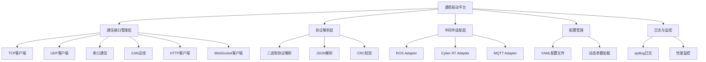
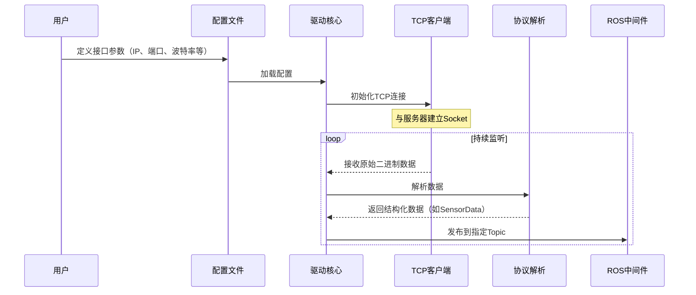

# modern_driver

## 1. 整体框架

```mermaid
graph TD
    A[通用驱动平台] --> B[通信接口管理层]
    A --> C[协议解析层]
    A --> D[中间件适配层]
    A --> E[配置管理]
    A --> F[日志与监控]

    B --> B1[TCP客户端]
    B --> B2[UDP客户端]
    B --> B3[串口通信]
    B --> B4[CAN总线]
    B --> B5[HTTP客户端]
    B --> B6[WebSocket客户端]

    C --> C1[二进制协议解析]
    C --> C2[JSON解析]
    C --> C3[CRC校验]

    D --> D1[ROS Adapter]
    D --> D2[Cyber RT Adapter]
    D --> D3[MQTT Adapter]

    E --> E1[YAML配置文件]
    E --> E2[动态参数加载]

    F --> F1[spdlog日志]
    F --> F2[性能监控]

```
## tcp交互流程图

``` mermaid
sequenceDiagram
    participant User as 用户
    participant Config as 配置文件
    participant Core as 驱动核心
    participant TCP as TCP客户端
    participant Parser as 协议解析
    participant ROS as ROS中间件

    User->>Config: 定义接口参数（IP、端口、波特率等）
    Config->>Core: 加载配置
    Core->>TCP: 初始化TCP连接
    Note over TCP: 与服务器建立Socket
    loop 持续监听
        TCP-->>Core: 接收原始二进制数据
        Core->>Parser: 解析数据
        Parser-->>Core: 返回结构化数据（如SensorData）
        Core->>ROS: 发布到指定Topic
    end
```